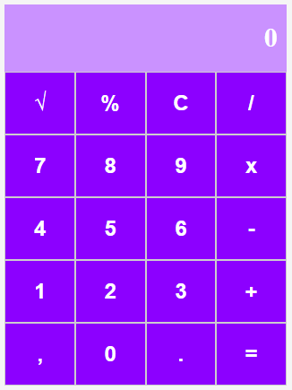

# Calculadora Simples em React

Este é um projeto de uma calculadora simples desenvolvido durante o curso de React da DIO - Formação React Developer. O objetivo foi aplicar os conceitos fundamentais do React, como componentização, estado e eventos, criando uma aplicação funcional e interativa. 
 


## 🛠️ Tecnologias utilizadas
- React: Biblioteca JavaScript para construção de interfaces.  
- JavaScript (ES6+): Para a lógica da aplicação.  
- HTML e CSS: Para a estrutura e estilização.

## ✨ Funcionalidades
- Operações: soma, subtração, multiplicação, divisão, porcentagem e raíz quadrada.
- Design simples e intuitivo.
- Atualização instantânea dos resultados ao realizar cálculos.
## 📚 Aprendizados
Durante o desenvolvimento deste projeto, foi possível reforçar conhecimentos sobre:

- Estruturação de projetos em React.
- Utilização do useState para gerenciar estados.
- Implementação de eventos e funções para interação com o usuário.
- Prática de componentização e reaproveitamento de código.

## 🚀 Executando o projeto

```
npm install
npm start
```
